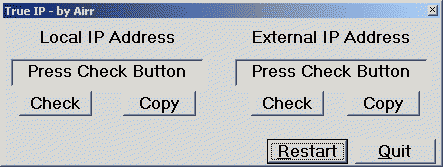



## TrueIP

### Description

# TrueIP 1.0

# Visual Basic Example

# (c) 2002, RMG Enterprises

# Example by Armando Rivera (Airr@msn.com)

** Note: This is my very first attempt at a VB program **

As an online gamer with a home network behind an Internet router,

I at times really wished for a utility that would allow me to

determine what my *actual* INTERNET IP address is, to allow me to

easily host games for friends.

I found quite a few VB based utils that would allow me to get

my *Local* IP address,but none that would get my *Internet* IP address.

So, I sat down with VB6, and coded TrueIP in about an hour. VB Vets

might laugh, but I was literally flying blind here. LOL

The proggy works by parsing the HTML from www.whatismyip.com, and

displays just the IP address in a small window, and using the winsock ocx

for the local IP. Short, sweet, and to the point.

If anyone enhances my virginal (LOL) attempt at coding, please share!

Thx.

AIR.
 
### More Info
 

             |
---                |---
**Submitted On**   |2002-09-03 11:21:54
**By**             |[Armando Rivera](https://github.com/Planet-Source-Code/PSCIndex/blob/master/ByAuthor/armando-rivera.md)
**Level**          |Beginner
**User Rating**    |4.1 (29 globes from 7 users)
**Compatibility**  |VB 6\.0
**Category**       |[Internet/ HTML](https://github.com/Planet-Source-Code/PSCIndex/blob/master/ByCategory/internet-html__1-34.md)
**World**          |[Visual Basic](https://github.com/Planet-Source-Code/PSCIndex/blob/master/ByWorld/visual-basic.md)
**Archive File**   |[TrueIP126038932002\.zip](https://github.com/Planet-Source-Code/armando-rivera-trueip__1-38624/archive/master.zip)

